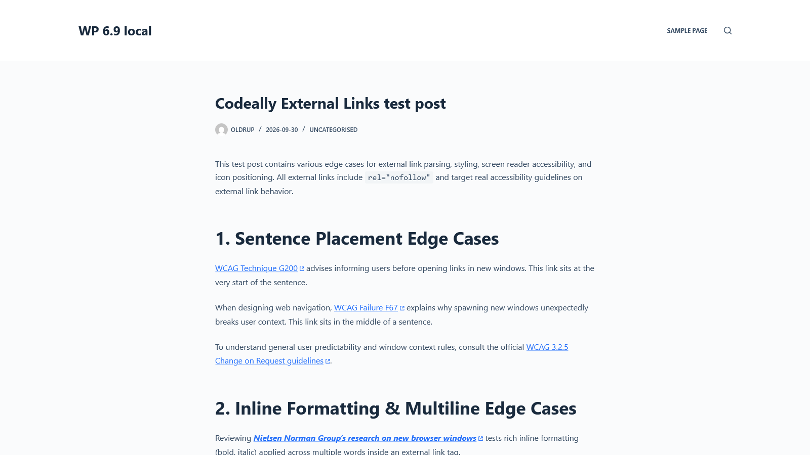

# Codeally External Links Icon

Automatically mark external links in WordPress content and show a recognizable icon, with no settings page or JavaScript.



## What it does

- Adds `rel="external"` to external links while WordPress renders post content.
- Displays a CSS-masked external-link icon beside external links.
- Provides a default box-arrow icon and an optional diagonal-arrow preset.
- Adds a localized screen-reader label to links marked `rel="external"`.
- Leaves post content and the database unchanged; no options or tables are created.

The icon is also shown on links with `target="_blank"` and native link blocks. Those links get a visual indicator only; the plugin does not add `rel="external"` or its screen-reader label to them.

## Requirements

- WordPress 6.9 or later
- PHP 8.2 or later
- A modern browser with CSS masking and `:has()` support

Tested up to WordPress 7.1. The plugin is intended for native WordPress Block Editor content; third-party page builders are not officially supported.

## Installation

1. Download the installable ZIP from [GitHub Releases](https://github.com/oldrup/codeally-external-links-icon/releases) when available. The ZIP attached to a release is the WordPress package; GitHub's automatically generated source archives are repository snapshots.
2. In WordPress, go to **Plugins > Add New Plugin > Upload Plugin**, choose the ZIP, and select **Install Now**.
3. Activate **Codeally External Links Icon**. It works automatically on the front end.

## Customize the icon

By default, external links use a box-arrow icon. To use the diagonal arrow inside a block, select the block in the editor and add `has-cdly-icon-arrow` under **Additional CSS class(es)**.

You can also set the icon globally or for a specific scope with CSS:

```css
:root {
    --cdly-external-links-icon: var(--cdly-mask-image-arrow);
}
```

Available presets are `--cdly-mask-image-box` and `--cdly-mask-image-arrow`. The icon and spacing can be customized with `--cdly-external-links-icon` and `--cdly-external-links-margin`.

## Accessibility and compatibility

The localized "external link" screen-reader label is applied to links with `rel="external"`. Links that only match `target="_blank"` or native link-block selectors receive an icon but no label from this plugin; use your theme or editor's accessibility options to describe links that open in a new tab.

The icon uses CSS masks and the `:has()` selector, so older browsers may not display it. The plugin has been tested with current Chrome, Safari, and Firefox, and with NVDA and Windows Narrator on Windows 11. A page cache may serve already-rendered HTML without rerunning WordPress's content filter; clear the cache after changing content if needed.

## Development

The plugin uses WordPress core's `WP_HTML_Tag_Processor` to update links during content rendering. It does not use JavaScript or permanently modify saved content.

See [the WordPress plugin readme](readme.txt) for the detailed FAQ and [the changelog](changelog.txt) for version history.

## License

GPL-2.0-or-later. See the [GNU General Public License](https://www.gnu.org/licenses/gpl-2.0.html).